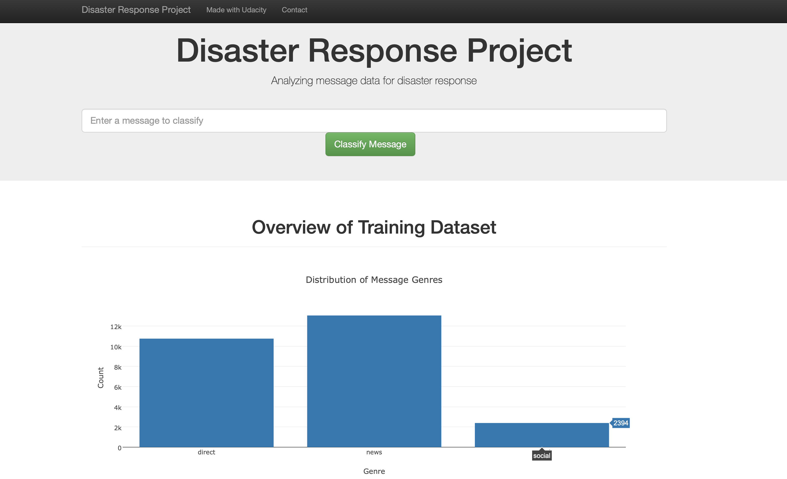

# Disaster Response Pipeline Project

## Project Motivation

In this project, I apply skills I learned in Data Engineering Section to analyze disaster data from Figure Eight to build a model for an API that classifies disaster messages.

## File Description

    .
    ├── app     
    │   ├── run.py                           # Flask file that runs app
    │   └── templates   
    │       ├── go.html                      # Classification result page of web app
    │       └── master.html                  # Main page of web app    
    ├── data                   
    │   ├── disaster_categories.csv          # Dataset including all the categories  
    │   ├── disaster_messages.csv            # Dataset including all the messages
    │   └── process_data.py                  # Data cleaning
    ├── models
    │   └── train_classifier.py              # Train ML model           
    └── README.md

## Results of the analysis

Results and discussion were published on Medium: https://medium.com/@shihaowen/dive-into-boston-and-seattle-airbnb-data-b4a9e79b740c  
In this project, I dived into the most recent Airbnb Boston and Seattle dataset and found many interesting phenomenom:
- We gathered the Boston and Seattle Airbnb data, and compare the two dataset.
- We established a machine learning model to predict the rental price for both cities.
- We took a look at the feature importance of the trained model and check if they make sense.
- We list all the important amenities to get a better feeling how host can make more money by providing better services to meet customers’ need.

### Instructions: (Run run.py directly if DisasterResponse.db and claasifier.pkl already exist.)
1. Run the following commands in the project's root directory to set up your database and model.

    - To run ETL pipeline that cleans data and stores in database
        `python data/process_data.py data/disaster_messages.csv data/disaster_categories.csv data/DisasterResponse.db`
    - To run ML pipeline that trains classifier and saves
        `python models/train_classifier.py data/DisasterResponse.db models/classifier.pkl`

2. Run the following command in the app's directory to run your web app.
    `python run.py`

3. Go to http://0.0.0.0:3001/

