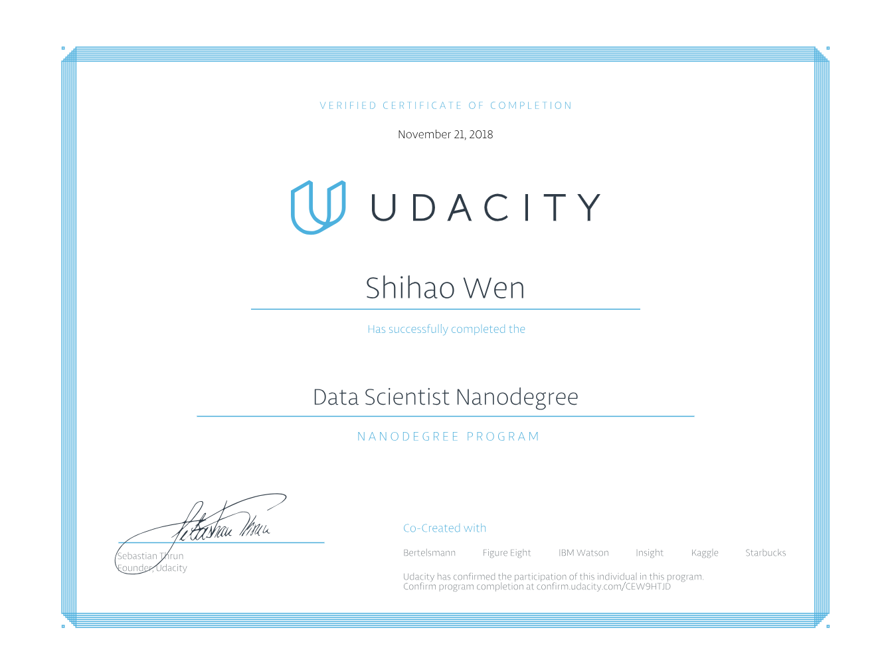

# Udacity-DSND
Collection of Projects of Udacity Data Scientist Nanodegree.

Project Lists:

1. Machine Learning: [Finding Donors for CharityML](https://github.com/wenshihao1993/Udacity-DSND/tree/master/Machine%20Learning/Supervised%20Learning%20Project)

2. Deep Learning:[Developing an AI application (Image Classifier)](https://github.com/wenshihao1993/Udacity-DSND/tree/master/Deep%20Learning/Deep%20Learning%20Project)

3. Unsupervised Learning: [Identify Customer Segments](https://github.com/wenshihao1993/Udacity-DSND/tree/master/Unsupervised%20Learning/Unsupervised%20Learning%20Project)

4. Data Science: [Dive Into Boston and Seattle Airbnb Data](https://github.com/wenshihao1993/Udacity-DSND/tree/master/Introduction_to_data_science)

5. Software Engineering [Data Dashboard Project](https://github.com/wenshihao1993/Udacity-DSND/tree/master/Software%20Engineering/Data%20Dashboard%20Project)

6. Data Engineering: [Disaster Response Pipeline Project](https://github.com/wenshihao1993/Udacity-DSND/tree/master/Data%20Engineering/Disaster%20Response%20Pipeline%20Project)

7. Recommendation System [IBM Recommandation System Project](https://github.com/wenshihao1993/Udacity-DSND/tree/master/Experimental%20Design%20%26%20Recommandations/IBM%20Recommendation%20System%20Project)

8. Capstone Projects: [Investigating Customer Segmentation for Arvato Financial Services](https://github.com/wenshihao1993/Udacity-DSND/tree/master/Capstone%20Project/Arvato%20Capstone%20Project)
