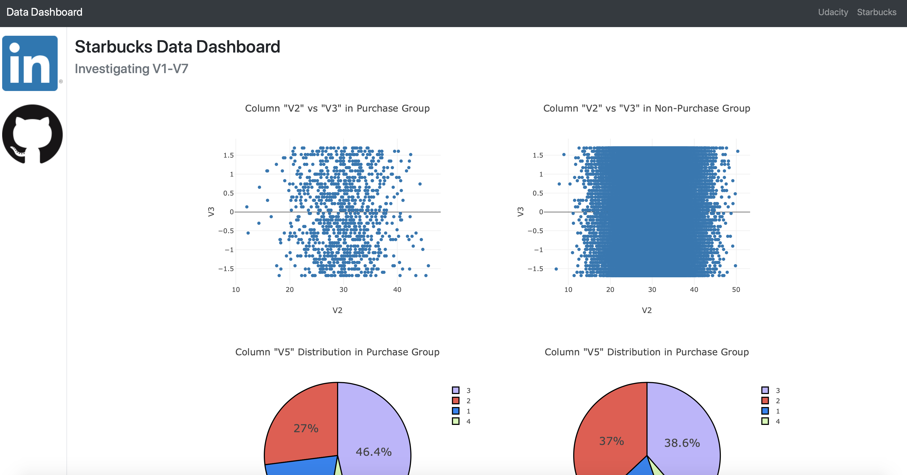

# Data Dashboard Project(In Progress)

## Project Motivation

In this project, I apply skills I learned in Software Engineering Section to develop and deploy a data dashboard.

## File Description

    .
    ├── myapp     
    │   ├── __init__.py                       
    │   ├── routes.py
    │   └── templates   
    │       └── index.html                   # Main page of web app    
    ├── data                 
    │   └── starbucks.csv                    # Starbucks Data
    ├── wrangling_scripts
    │   └── wrangle_data.py                  # Data wrangling and plotting        
    ├── myapp.py  
    └── README.md

### Instructions:

1. Run the following command in the app's directory to run your web app.
    `python myapp.py`

2. Go to http://0.0.0.0:3001/

